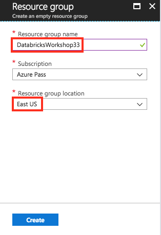
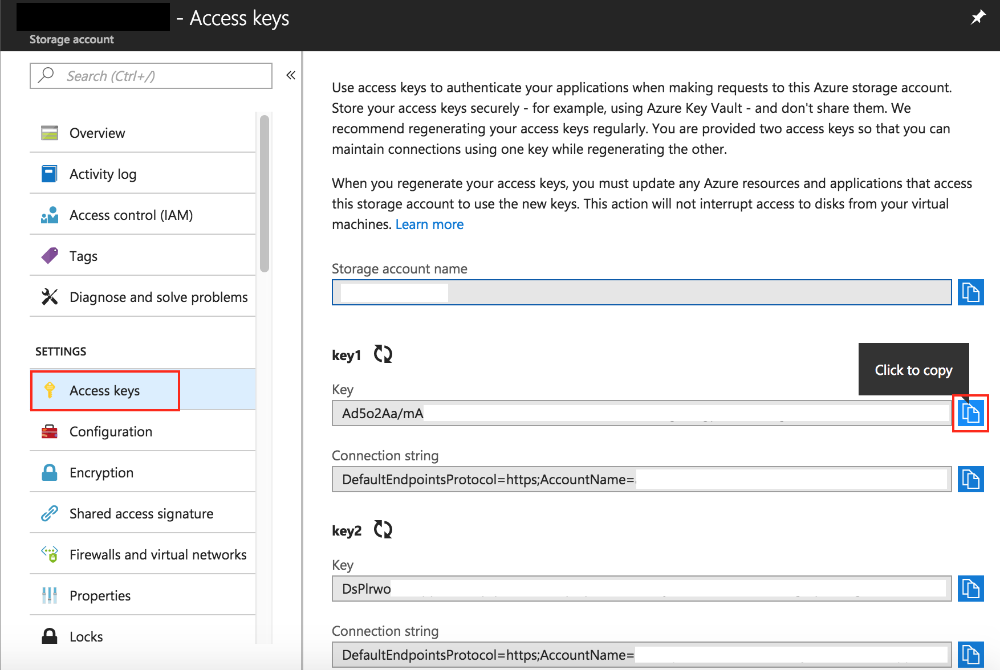
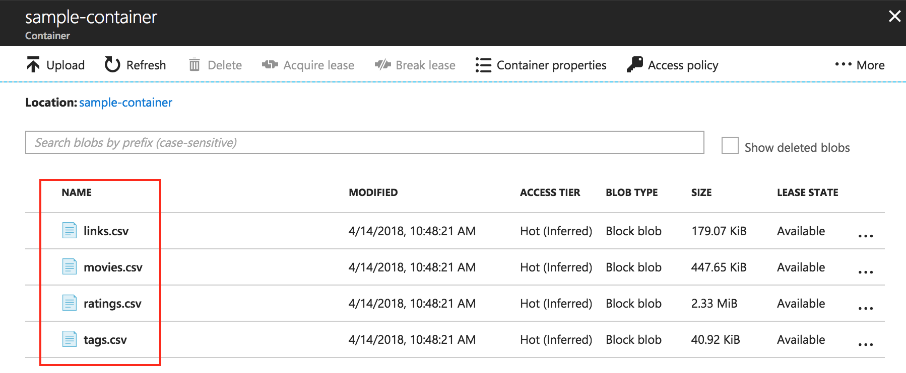
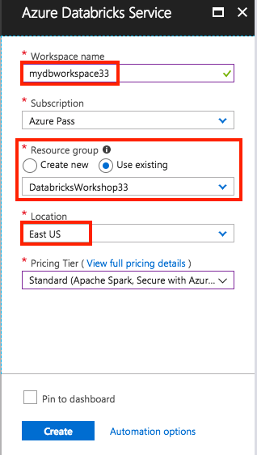
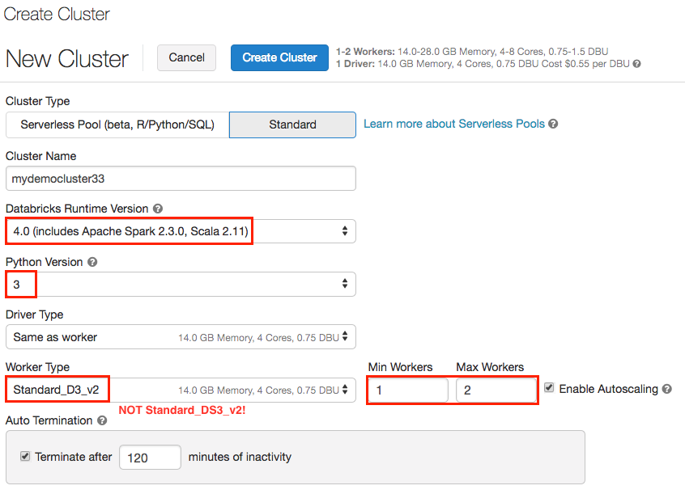
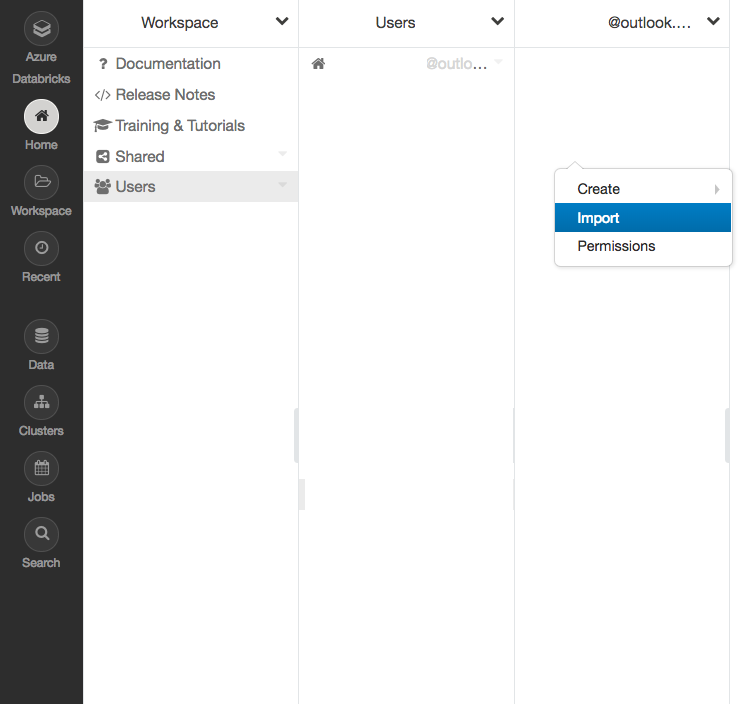
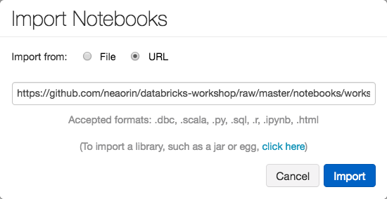
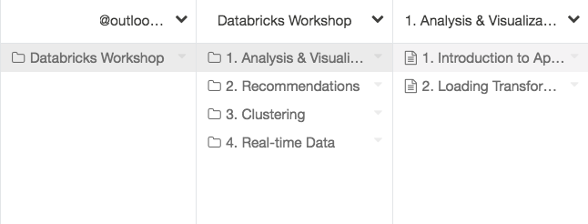

# Hands-on Workshop: using Apache Spark & Azure Databricks

This is a hands-on workshop which will allow you to experiment with [Apache Spark](https://spark.apache.org/) running in the [Azure Databricks](https://azure.microsoft.com/en-us/services/databricks/) platform. You’ll understand how you can use Spark and Azure Databricks to analyze large amounts of customer data, visualize the data to quickly spot patterns, use Spark’s Machine Learning library to generate predictions, and analyze real-time data from online sources (e.g. Twitter).

A PowerPoint presentation of Azure Databricks used as an intro for this workshop can be found here: [Powerful Big Data Analytics as a Service, with Apache Spark and Azure Databricks](https://www.slideshare.net/SorinPeste/powerful-big-data-analytics-as-a-service-with-apache-spark-and-azure-databricks)

## Agenda

1. Introduction to Apache Spark and Azure Databricks
2. Hands-on Labs
    - Setting up Azure Databricks and creating Spark clusters
    - Accessing data from cloud storage
    - Interactive data analysis and visualization with Databricks notebooks, Spark SQL and Python
    - Build a product recommendations engine using Spark MLlib and collaborative filtering
    - Perform customer segmentation using Spark MLlib and clustering
    - Sentiment Analysis on real-time Twitter data, with Spark Streaming
3. Wrap-up

## Prerequisites

The main prerequisite for this workshop is an active [Microsoft Azure](https://azure.microsoft.com/) subscription. Please ask your instructor for access to an Azure subscription, if you don't already have one available.

If you plan on completing the Twitter data analysis lab, you'll also need a Twitter account.

## Setup

The setup for this workshop involves the following steps:

1. [Log in to Microsoft Azure](#setup1)
2. [Create an Azure storage account and upload the workshop data](#setup2)
3. Get an Azure Databricks workspace
    * 3a. [Create an Azure Databricks workspace and a Spark cluster](#setup3a), *or*
    * 3b. [Connect to an existing Azure Databricks Workspace](#setup3b)
4. [Import the lab notebooks](#setup4)

The detailed steps are presented below.


<a name="setup1"></a>
## 1. Log in to Microsoft Azure

Log in to the [Azure portal](https://portal.azure.com).

<a name="setup2"></a>
## 2. Create an Azure storage account and upload the workshop data

An Azure storage account provides a unique namespace in the cloud to store and access your data objects in Azure Storage. A storage account contains any blobs, files, queues, tables, and disks that you create under that account. 

To get started with Azure Storage, you first need to create a new storage account. 

## Create a resource group

An Azure resource group is a logical container into which Azure resources are deployed and managed. For more information on resource groups, see [Azure Resource Manager overview](../../azure-resource-manager/resource-group-overview.md).

To create a resource group in the Azure portal, follow these steps:

1. In the Azure portal, expand the menu on the left side to open the menu of services, and choose **Resource Groups**.
2. Click the **Add** button to add a new resource group.
3. Enter a name for the new resource group.

> [!NOTE]
> Please use the name **DatabricksWorkshopNN** for your resource group, where NN is your User ID (ask your instructor for details).

4. Select the subscription in which to create the new resource group.
5. Choose the location for the resource group.
6. Click the **Create** button.  




## Create a general-purpose storage account

A general-purpose storage account provides access to all of the Azure Storage services: blobs, files, queues, and tables. A general-purpose storage account can be created in either a standard or a premium tier. The examples in this article show how to create a general-purpose storage account in the standard tier (the default).

Azure Storage offers two types of general-purpose storage accounts:

- General-purpose v2 accounts 
- General-purpose v1 accounts. 

> [!NOTE]
> It's recommended that you create new storage accounts as **general-purpose v2 accounts**, to take advantage of newer features available to those accounts.  

For more information about storage account types, see [Azure Storage account options](storage-account-options.md).

When naming your storage account, keep these rules in mind:

- Storage account names must be between 3 and 24 characters in length and may contain numbers and lowercase letters only.
- Your storage account name must be unique within Azure. No two storage accounts can have the same name.

> [!NOTE]
> Please use the name **dbworkshopstoreNN** for your storage account, where NN is your User ID (ask your instructor for details).

To create a general-purpose v2 storage account in the Azure portal, follow these steps:

1. In the Azure portal, expand the menu on the left side to open the menu of services, and choose **All services**. Then, scroll down to **Storage**, and choose **Storage accounts**. On the **Storage Accounts** window that appears, choose **Add**.
2. Enter a name for your storage account.
3. Set the **Account kind** field to **StorageV2 (general-purpose v2)**.
4. Leave the **Replication** field set to **Locally-redundant storage (LRS)**. Alternately, you can chooose **Zone-redundant storage (ZRS Preview)**, **Geo-redundant storage (GRS)**, or **Read-access geo-redundant storage (RA-GRS)**.
5. Leave these fields set to their defaults: **Deployment model**, **Performance**, **Secure transfer required**.
6. Choose the subscription in which you want to create the storage account.
7. In the **Resource group** section, select **Use existing**, then choose the resource group you created in the previous section.
8. Choose the location for your new storage account.
9. Click **Create** to create the storage account.      


## Get the storage Primary Access Key

After your storage account is created, navigate to it in the Portal. Under **Settings**, select **Access keys**. Select the primary account access key and click the Copy button to copy the associated connection string to the clipboard. Then paste the string into a text editor for later use.



## Create a container

A **container** organizes a set of blobs, similar to a folder in a file system. All blobs reside within a container. A storage account can contain an unlimited number of containers, and a container can store an unlimited number of blobs. Note that the container name must be lowercase.

To create a container in the Azure portal, follow these steps:

1. Navigate to your new storage account in the Azure portal.
2. In the left menu for the storage account, scroll to the **Blob Service** section, then select **Browse Blobs**.
3. Click the **Add Container** button.
4. Enter a name for your new container. The container name must be lowercase, must start with a letter or numberm and can contain only letters, numbers, and the dash (-) character. See [Naming and Referencing Containers, Blobs, and Metadata](https://docs.microsoft.com/rest/api/storageservices/naming-and-referencing-containers--blobs--and-metadata) for more information about container and blob names.
5. Set the level of public access to the container. The default level is **Private (no anonymous access)**.
6. Click **OK** to create the container.

    


## Download the MovieLens data

This workshop uses data from the [MovieLens datasets](https://grouplens.org/datasets/movielens/). 

The [Small MovieLens dataset](http://files.grouplens.org/datasets/movielens/ml-latest-small-README.html) describes 5-star rating and free-text tagging activity from MovieLens, a movie recommendation service. It contains 100004 ratings and 1296 tag applications across 9125 movies. These data were created by 671 users between January 09, 1995 and October 16, 2016. This dataset was generated on October 17, 2016.

Users were selected at random for inclusion. All selected users had rated at least 20 movies. No demographic information is included. Each user is represented by an id, and no other information is provided.

1. Download the small dataset: [ml-latest-small.zip](http://files.grouplens.org/datasets/movielens/ml-latest-small.zip)

    > [!NOTE]
    > If the link above no longer works, you can also download the dataset from [this repository](data/ml-latest-small.zip).


2. Unpack the ZIP archive to your local drive.

## Upload the MovieLens data to Azure Storage

We will upload the MovieLens data as separate block blobs.

**Block blobs** consist of blocks of data assembled to make a blob (binary large object). Most scenarios using Blob storage employ block blobs. Block blobs are ideal for storing text and binary data in the cloud, like files, images, and videos. This shows how to work with block blobs. 

To upload a block blob to your new container in the Azure portal, follow these steps:

1. In the Azure portal, navigate to the container you created in the previous section.
2. Select the container to show a list of blobs it contains. In this case, since you created a new container, it won't yet contain any blobs.
3. Click the **Upload** button to upload a blob to the container.
4. Browse your local file system to find a file to upload as a block blob, and click **Upload**.
5. Upload all the CSV files from the MovieLens archive in the same way. You'll see that the new blobs are now listed within the container.

    

> [!NOTE]
> You should upload the following  files from the MovieLens dataset archive:
> - *links.csv*
> - *movies.csv*
> - *ratings.csv*
> - *tags.csv*

<a name="setup3a"></a>
## 3a. Create an Azure Databricks workspace and a Spark cluster

In this section, you create an Azure Databricks workspace using the Azure portal. 

1. In the Azure portal, select **Create a resource** > **Data + Analytics** > **Azure Databricks**. 

    

3. Under **Azure Databricks Service**, provide the values to create a Databricks workspace.

    

    Provide the following values: 
     
    |Property  |Description  |
    |---------|---------|
    |**Workspace name**     | use **mydbworkspaceNN**, where NN is your user id.        |
    |**Subscription**     | From the drop-down, select your Azure subscription.        |
    |**Resource group**     | Select the resource group you provisioned earlier. |
    |**Location**     | Select **East US**. For other available regions, see [Azure services available by region](https://azure.microsoft.com/regions/services/).        |
    |**Pricing Tier**     |  Choose  **Standard**. For more information on these tiers, see [Databricks pricing page](https://azure.microsoft.com/pricing/details/databricks/).       |


4. The workspace creation takes a few minutes. 

## Create a Spark cluster in Databricks

1. In the Azure portal, go to the Databricks workspace that you created, and then click **Launch Workspace**.

2. You are redirected to the Azure Databricks portal. From the portal, click **Cluster**.

    

3. In the **New cluster** page, provide the values to create a cluster.

    

    Accept all other default values other than the following:

    * Enter a name for the cluster.
    * For this workshop, create a cluster with **4.0** runtime, and Python Version **3**. 
    * Set Min Workers to **1** and Max Workers to **2** for this workshop.
    * Make sure you select the **Standard_D3_v2** Worker Type, instead of the default *Standard_DS3_v2*.
    
    Select **Create cluster**. Once the cluster is running, you can attach notebooks to the cluster and run Spark jobs. 

For more information on creating clusters, see [Create a Spark cluster in Azure Databricks](https://docs.azuredatabricks.net/user-guide/clusters/create.html).

<a name="setup3b"></a>
## 3b. Connect to an existing Azure Databricks Workspace 

As an alternative to creating a separate workspace and Spark cluster, you may work with an existing Azure Databricks workspace. Ask your instructor for the name of the workspace to use.

1. In the Azure portal, use the [Global search](https://azure.microsoft.com/en-us/updates/global-search-in-the-azure-portal/) function to locate the existing Azure Databricks workspace.

2. Open the Azure Databricks workspace, and then click **Launch Workspace**.

3. You are redirected to the Azure Databricks portal.

<a name="setup4"></a>
## 4. Import the lab notebooks

You will now import the Databricks notebooks which contain the lab exercises into the Azure Databricks workspace.

1. In the Azure Databricks workspace homepage, click **Home** from the left menu. 
2. Inside your user home directory, right click and click **Import**.

    

3. Select **URL**, and paste in the following URL: 

    ```https://github.com/neaorin/databricks-workshop/raw/master/notebooks/workshop2019.dbc```

    

4. Click **Import**.

Once the import is complete, you should see a new folder named **Databricks Workshop**. 



At this point you can open any of the Databricks notebooks inside that folder, or its subfolders, and dive into the various lab topics.